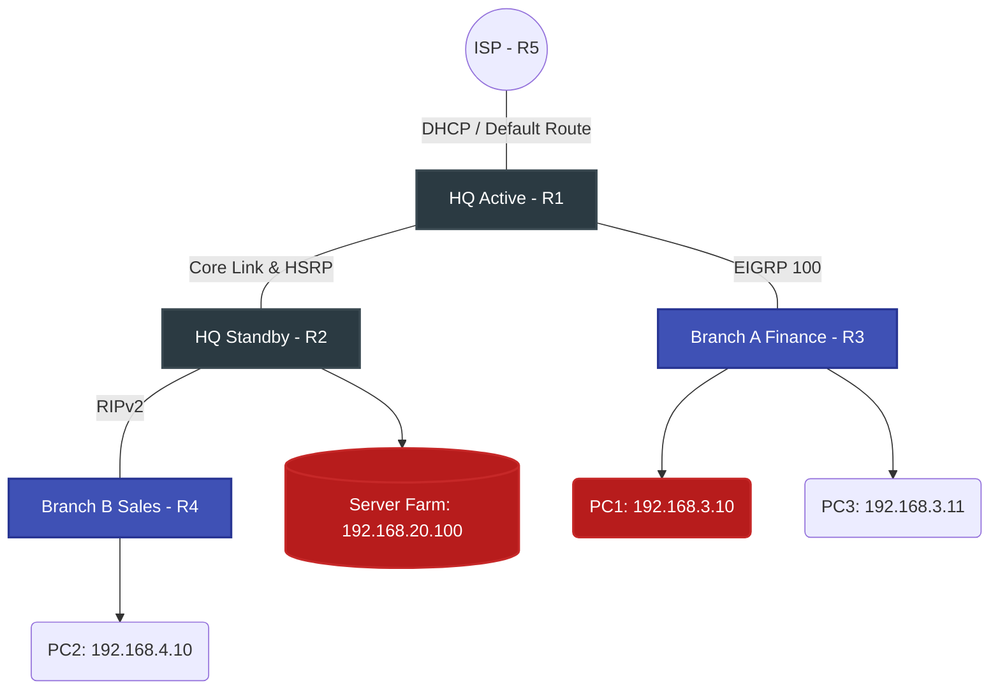

# Network Topology Diagram



---
# 🖥️ End-Devices IP Allocation Table

| **Device Name** |  **IP Address**  | **Subnet Mask** | **Default Gateway** |
| :-------------: | :--------------: | :-------------: | :-----------------: |
|     **PC1**     |  `192.168.3.10`  | `255.255.255.0` |    `192.168.3.1`    |
|     **PC3**     |  `192.168.3.11`  | `255.255.255.0` |    `192.168.3.1`    |
|     **PC2**     |  `192.168.4.10`  | `255.255.255.0` |    `192.168.4.1`    |
|   **Server**    | `192.168.20.100` | `255.255.255.0` |   `192.168.20.1`    |
|  **Admin PC**   | `192.168.20.10`  | `255.255.255.0` |   `192.168.20.1`    |

---
# ⚙️ ISP Configuration (R5)
```bash
enable
configure terminal
hostname ISP

! 1. Interface connected to Headquarters (R1)
interface GigabitEthernet0/1
 ip address 203.0.113.1 255.255.255.0
 no shutdown
 exit

! 2. DHCP Configuration to assign IP to R1
ip dhcp pool ISP_POOL
 network 203.0.113.0 255.255.255.0
 default-router 203.0.113.1
 exit

end
write memory
```

---
# 🏢 Headquarters - Active Router Configuration (HQ - R1)
```bash
enable
configure terminal
hostname R1

! 1. Interfaces & HSRP Setup
interface GigabitEthernet0/1
 ip address dhcp
 no shutdown
 exit

interface GigabitEthernet0/0
 ip address 192.168.1.2 255.255.255.0
 standby 1 ip 192.168.1.1
 standby 1 priority 150
 standby 1 preempt
 no shutdown
 exit

interface Serial0/0/0
 ip address 10.1.1.1 255.255.255.252
 clock rate 64000
 no shutdown
 exit

! 2. Dynamic Routing Protocols (OSPF & EIGRP)
router ospf 1
 network 192.168.1.0 0.0.0.255 area 0
 exit

router eigrp 100
 network 10.1.1.0 0.0.0.3
 exit

! 3. Static Routing (The Glue)
! Static route to Branch B (Sales) via R2
ip route 192.168.4.0 255.255.255.0 192.168.1.3
! Default route to the ISP
ip route 0.0.0.0 0.0.0.0 203.0.113.1

end
write memory
```

---
# 🏢 Headquarters - Standby Router Configuration (HQ - R2)
```bash
enable
configure terminal
hostname R2

! 1. Access Control List (ACL 2 - Server Farm Protection)
access-list 102 deny tcp host 192.168.3.10 host 192.168.20.100 eq 80
access-list 102 permit ip any any

! 2. Interfaces, HSRP Setup, and ACL Application
interface GigabitEthernet0/0
 ip address 192.168.1.3 255.255.255.0
 standby 1 ip 192.168.1.1
 standby 1 preempt
 no shutdown
 exit

interface GigabitEthernet0/1
 ip address 192.168.20.1 255.255.255.0
 ip access-group 102 out
 no shutdown
 exit

interface Serial0/0/0
 ip address 10.2.2.1 255.255.255.252
 clock rate 64000
 no shutdown
 exit

! 3. Dynamic Routing Protocols (OSPF & RIP)
router ospf 1
 network 192.168.1.0 0.0.0.255 area 0
 network 192.168.20.0 0.0.0.255 area 0
 exit

router rip
 version 2
 no auto-summary
 network 10.0.0.0
 exit

! 4. Static route to Branch A (Finance) via R1
ip route 192.168.3.0 255.255.255.0 192.168.1.2

end
write memory
```

---
# 💰 Branch A Configuration (Finance - R3)
```bash
enable
configure terminal
hostname R3

! 1. Access Control List (ACL 1 - Finance Protection)
access-list 101 deny ip 192.168.4.0 0.0.0.255 host 192.168.3.10
access-list 101 permit ip any any

! 2. Interfaces Setup and ACL Application
interface GigabitEthernet0/0
 ip address 192.168.3.1 255.255.255.0
 ip access-group 101 out
 no shutdown
 exit

interface Serial0/0/0
 ip address 10.1.1.2 255.255.255.252
 no shutdown
 exit

! 3. Routing (EIGRP & Default Route)
router eigrp 100
 network 10.1.1.0 0.0.0.3
 network 192.168.3.0 0.0.0.255
 exit

! Default route towards HQ
ip route 0.0.0.0 0.0.0.0 10.1.1.1

end
write memory
```

---
# 🛒 Branch B Configuration (Sales - R4)
```bash
enable
configure terminal
hostname R4

! 1. Interfaces Setup
interface GigabitEthernet0/0
 ip address 192.168.4.1 255.255.255.0
 no shutdown
 exit

interface Serial0/0/0
 ip address 10.2.2.2 255.255.255.252
 no shutdown
 exit

! 2. Routing (RIP & Default Route)
router rip
 version 2
 no auto-summary
 network 10.0.0.0
 network 192.168.4.0
 exit

! Default route towards HQ
ip route 0.0.0.0 0.0.0.0 10.2.2.1

end
write memory
```

---
# Device Hardening Script
```bash
enable
configure terminal
! 1. Encrypt all plaintext passwords
service password-encryption

! 2. Set an encrypted Enable password
enable secret Admin@123

! 3. Set a Warning Banner (Legal Mitigation)
banner motd #
*************************************************
* WARNING: UNAUTHORIZED ACCESS IS PROHIBITED.   *
* All activities on this device are monitored.  *
*************************************************
#

! 4. Secure Console Line
line console 0
 password cisco
 login
 logging synchronous
 exit

! 5. Secure VTY (Telnet/SSH) Lines
line vty 0 4
 password cisco
 login
 exit
do write memory
```

```txt
! Pass
Admin@123
```
---
# 🛡️ Security Audit & Penetration Testing Report

As part of the network deployment, a post-configuration security audit was conducted to ensure compliance with the organization's security policies.

### Threat Mitigation Strategies Implemented:
1. **Network Segmentation:** Applied Extended ACLs to isolate the Finance Department from lateral movement originating from the Sales Department.
2. **Device Hardening:** Implemented `service password-encryption`, secure console access, and legal warning banners on all infrastructure devices.
3. **Service Restriction:** Blocked unauthorized HTTP (Port 80) access to the Server Farm while maintaining ICMP for network diagnostics.

### 🧪 Verification Test Cases (Red Team Perspective):

| Test ID    | Source          | Target          | Protocol  | Expected Result           | Actual Result       | Status |
| :--------- | :-------------- | :-------------- | :-------- | :------------------------ | :------------------ | :----- |
| **SEC-01** | `PC2` (Sales)   | `PC1` (Finance) | ICMP      | `Destination Unreachable` | `Blocked by R3 ACL` | ✅ PASS |
| **SEC-02** | `PC2` (Sales)   | `PC3` (Finance) | ICMP      | `Reply`                   | `Reply Received`    | ✅ PASS |
| **SEC-03** | `PC1` (Finance) | `Server`        | HTTP (80) | `Request Timeout`         | `Blocked by R2 ACL` | ✅ PASS |
| **SEC-04** | `PC1` (Finance) | `Server`        | ICMP      | `Reply`                   | `Reply Received`    | ✅ PASS |

> [!NOTE]
> The successful execution of `SEC-01` and `SEC-03` confirms that the network is resilient against unauthorized cross-departmental access and unauthorized web service queries.

---

|       **(Full Command)**       |  ** (Abbreviation)**  |
| :----------------------------: | :-------------------: |
|            `enable`            |         `en`          |
|      `configure terminal`      |       `conf t`        |
| `interface GigabitEthernet0/0` |      `int g0/0`       |
|    `interface Serial0/0/0`     |     `int s0/0/0`      |
|          `ip address`          |       `ip add`        |
|         `no shutdown`          |        `no sh`        |
|             `exit`             |         `ex`          |
|         `write memory`         |         `wr`          |
|           `network`            |         `net`         |
|    `standby 1 priority 150`    |  `standby 1 pri 150`  |
|      `standby 1 preempt`       |    `standby 1 pre`    |
|   `ip access-group 101 out`    | `ip access-g 101 out` |
